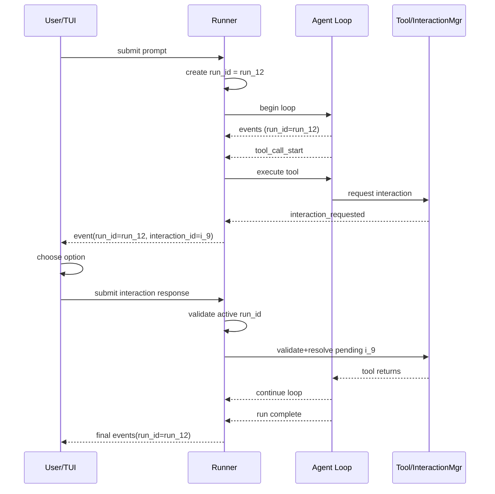

# Run ID Semantics

## Purpose

`run_id` identifies one active execution of `AgentRunner.Run(...)`.

It exists to correlate all runtime events and external control inputs with the correct run.

## Definition

- A `run_id` is created at the start of each run.
- A run is one invocation of `AgentRunner.Run(ctx, input, onEvent)`.
- All events emitted from that run carry the same `run_id`.
- Any interaction response submitted from outside must target the currently active run.

## Current Generation Rules

Current implementation generates IDs in-process using a monotonic counter:

- Format: `run_<n>`
- Example: `run_1`, `run_2`, `run_3`

Properties:

- Unique within one process lifetime.
- Not globally unique across restarts.
- Counter resets when the process restarts.

## Lifecycle

1. `AgentRunner.Run(...)` starts.
2. Runner creates a new `run_id` and an `InteractionManager`.
3. Runner marks that run as active.
4. Agent loop emits events with that `run_id`.
5. Tools can request interactions under that `run_id`.
6. External responses are accepted only for the active run.
7. When run finishes (success/error/cancel), active run is cleared.

## How `run_id` Changes

- It does not change during a run.
- It changes only when a new run starts.
- Multiple user turns in the same session still produce different `run_id` values (one per run).

## Relationship to Session and Turn IDs

`run_id` is not 1:1 with `(session_id, turn_id)`.

- One `session_id` can have many `run_id` values (one per submitted run).
- One `run_id` can have many `turn_id` values (provider/tool loop turns inside that run).
- `turn_id` resets for each new run.

Practical model:

- Session = long-lived conversation container.
- Run = one execution instance.
- Turn = step index within that run.

## Interaction and Tool Correlation

`run_id` is the top-level correlation key. It is used together with:

- `turn_id`: turn-local sequencing inside a run.
- `tool_call_id`: one tool invocation inside a turn.
- `interaction_id`: one pending interaction (question/approval/confirm).

Recommended matching order when processing external input:

1. Validate `run_id` matches active run.
2. Validate `interaction_id` exists and is pending.
3. Validate payload against interaction contract.

## Invariants

- Exactly zero or one active run per `AgentRunner` instance.
- Every emitted runtime event has `run_id`.
- A submitted interaction response must resolve at most once.
- A response for unknown/expired run or interaction is rejected.

Current runner behavior on response submission:

- If there is no active run, reject.
- If `run_id` is provided and mismatches active run, reject.
- If `run_id` is omitted, runner can fill active run ID.
- `interaction_id` must still refer to a pending interaction.

## Failure Modes and Expected Behavior

- Stale response from previous run: reject as no active matching run.
- Response without `run_id`: runner may fill current active `run_id`; reject if no active run.
- Duplicate response for same interaction: reject as duplicate.
- Process restart: old `run_id` values are no longer meaningful to new process.

## Storage and Persistence Notes

Current behavior is in-memory only:

- Active run state is not persisted.
- Pending interactions are not restored after process restart.

If durability is required later, preserve this contract:

- `run_id` remains immutable per run.
- Event and interaction records include `run_id` for replay and audit.
- Recovered pending interactions must retain original `run_id`.

## API Guidance

- Always include `run_id` in external control-plane payloads.
- Treat missing or mismatched `run_id` as protocol error.
- Log `run_id` on user-visible failures to make debugging traceable.

## Why Keep `run_id` if `interaction_id` Exists?

`interaction_id` is the primary key for resolving a pending interaction, and can be sufficient in a single-run, in-memory setup.

`run_id` is still recommended because it adds a strong safety boundary and future compatibility:

- Guards against stale responses from previous runs.
- Supports future concurrent runs and multi-tab clients.
- Improves observability and audit trails.
- Keeps protocol stable as steering and approval features expand.

Recommended posture:

- Keep `interaction_id` required.
- Keep `run_id` in protocol and validate it when present.
- Move to strict `run_id` requirement if/when concurrent runs are enabled.

## Sequence Diagram

Validation points in the sequence:

- Runner checks `run_id` matches the active run (when provided).
- Interaction manager checks `interaction_id` exists and is still pending.
- Duplicate/stale replies are rejected before tool execution resumes.
