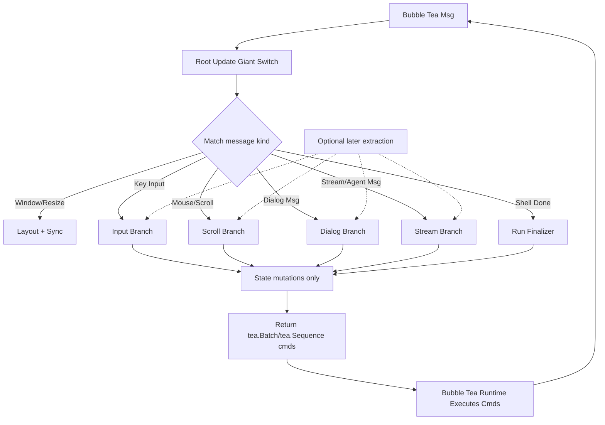

# TUI Architecture

This document describes a maintainable Bubble Tea architecture for this codebase.
It follows the same core approach as Crush (single top-level model, typed messages,
and command-driven side effects), with a pragmatic rollout:

- start with one clear giant `Update` switch,
- split into handlers only when complexity proves it is necessary.

## Goals

- Keep behavior explicit and testable.
- Keep side effects out of `Update`.
- Keep rendering deterministic.
- Keep growth manageable as interaction modes and tools expand.

## Core Principles

1. **Single root model**
   - One `tea.Model` owns orchestration.
   - Child widgets are stateful components with imperative methods, not nested
     Bubble Tea models by default.

2. **Single `State` with embedded slices**
   - Keep one top-level `State` type for ownership and readability.
   - Embed three focused state types:
     - `domainState`: persisted or conversation state (session items, tool
       calls).
     - `uiState`: mode/focus/dialog/selection/layout-facing state.
     - `runtimeState`: transient execution state (busy, cancel functions,
       stream, pending refresh flags, perf/debug counters).

   Example shape:

   ```go
   type State struct {
       domainState
       uiState
       runtimeState

       // dependencies/components
       runner *agent.AgentRunner
       input  textarea.Model
       // ...
   }
   ```

3. **Message-first architecture**
   - External events (agent stream, shell completion, timers, dialog actions)
     are converted into typed messages.
   - `Update` mutates state and returns commands only.

4. **Command boundary for IO**
   - Network/process/disk work runs in `tea.Cmd`.
   - Commands never mutate model state directly.

5. **Deterministic view pipeline**
   - `View` computes layout and read-only view models, then renders.
   - Rendering depends only on current model state.

## Module Shape

### Phase 1: Start simple

- `app.go`
  - Root `model`/`State`, `Init`, giant `Update` switch, run lifecycle.
- `app_layout.go`
  - `computeLayout` and layout invariants.
- `app_view.go`, `app_widgets.go`
  - Frame view model and pure rendering composition.

### Phase 2: Split only when needed

Extract handlers when one of these is true:

- `Update` is hard to reason about in a single pass.
- A branch has enough complexity to deserve focused tests.
- New work frequently conflicts in the same `Update` region.

Typical extraction order:

1. input handling (`app_update_input.go`)
2. stream/agent events (`app_update_stream.go`)
3. dialog routing (`app_update_dialog.go`)
4. scroll behavior (`app_update_scroll.go`)
5. run lifecycle helpers (`app_update_run.go`)
6. window resize (`app_update_branches.go`)

All extracted handlers preserve top-level dispatch in `app.go` - the giant switch
routes to handlers rather than replacing the centralized message matching.

## Update Flow



## State Ownership and Invariants

- `domain` state is the source of truth for conversation history and turn items.
- `ui` state controls interaction mode and focus routing.
- `runtime` state can be reset/recomputed without data loss.

Important invariants:

- At most one active run cancellation function at a time.
- Busy state transitions are centralized in run lifecycle handlers.
- Autoscroll transitions are explicit (user scroll disables, bottom/refresh can
  re-enable).
- Persisted state updates happen in domain mutations, not in view code.

## Why This Matches Crush (and Where It Differs)

### Alignment

- Single top-level Bubble Tea model.
- Child components are imperative and render-focused.
- Side effects executed through commands and returned as messages.
- Dialog/focus/mode routing handled centrally.

### Difference

- This architecture starts with a giant switch intentionally, then introduces
  bounded handlers only when complexity demands it.

## Trade-offs

### Crush-style giant central router

- **Pros**: direct control flow; easier to trace from one file.
- **Cons**: grows quickly; high coupling; harder local reasoning and safer
  refactors.

### Giant switch first, then bounded handlers (recommended)

- **Pros**: fast early development; direct control flow; gradual complexity
  management.
- **Cons**: requires discipline to split before readability degrades.

## Testing Strategy

- Unit-test core `Update` branches with focused message sequences.
- Keep snapshot/golden tests for full-frame render behavior.
- Add invariant tests for:
  - run lifecycle transitions,
  - autoscroll behavior,
  - dialog precedence,
  - resize/layout stability,
  - busy-mode behavior.
- Add branch-focused tests for extracted handlers to ensure they preserve
  behavior.

## Migration Plan

1. Keep existing behavior and tests as baseline.
2. Keep giant switch until pain is real and measurable.
3. Extract one handler at a time (input -> scroll -> stream -> dialogs -> run
   lifecycle).
4. Keep message types unchanged during extraction.
5. Add small invariants tests around each extracted handler.
6. Remove dead branches and duplicate helper paths once tests are green.

This approach stays close to Crush's proven architecture while improving
maintainability for a fast-growing interaction surface.
